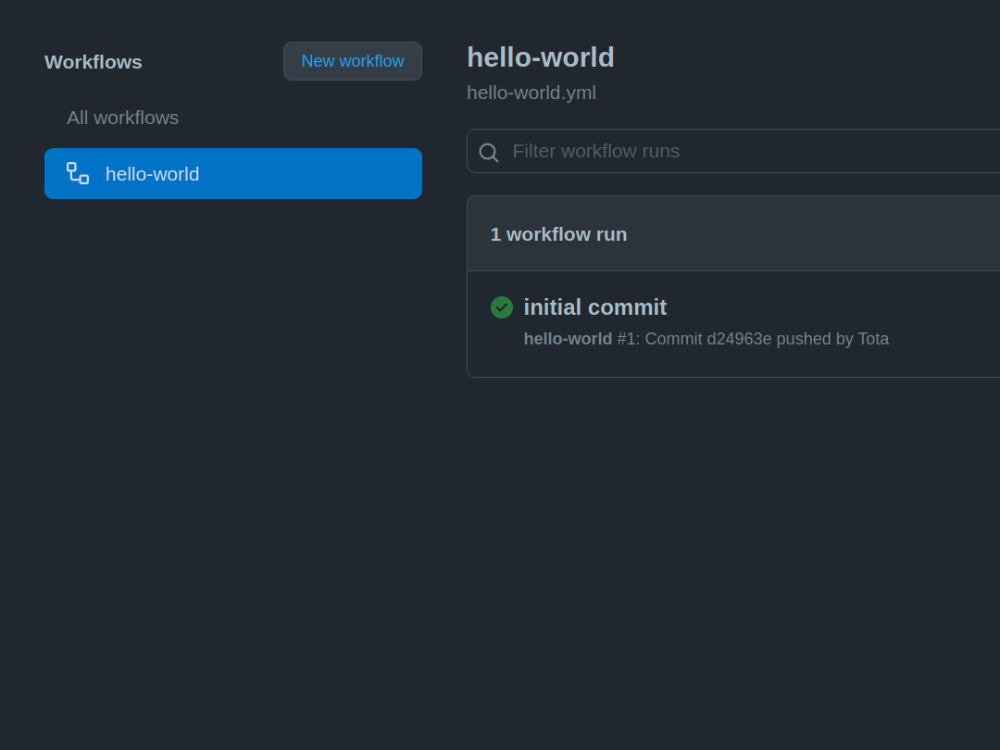

## Непрерывная интеграция (CI)
Локальный запуск тестов – персональная ответственность. Хорошие разработчики используют тесты непрерывно во время разработки и обязательно запускают их перед пушем (`git push`).

Но этого недостаточно. Там, где есть люди, присутствует человеческий фактор и ошибки. Поэтому, даже несмотря на локальный запуск, тесты должны запускаться автоматически на серверах непрерывной интеграции.

Непрерывная интеграция – практика разработки, которая заключается в частой автоматизированной сборке приложения для быстрого выявления проблем. Обычно интеграция выполняется на коммиты в репозиторий. За этим следит либо специальный сервер, либо сервис непрерывной интеграции. Он загружает код, собирает его (если это нужно для текущего приложения) и запускает различные проверки. Что и как запускать – определяется программистом. В первую очередь это тесты и линтер (проверка оформления кода). Кроме них могут запускаться утилиты, анализирующие безопасность, актуальность зависимостей и многое другое.


Немного терминологии и описание процесса. На каждый коммит запускается сборка (build). Во время сборки собирается приложение, устанавливаются зависимости, прогоняются тесты и все остальные проверки. Сборка, завершившаяся без ошибок, считается успешной. Если сборка не проходит, то программист получает уведомление. Дальше он смотрит отчёт и исправляет ошибки.

Для внедрения непрерывной интеграции есть два пути. Первый, поставить себе на сервер Jenkins или его аналог. Этот вариант требует много ручной работы (плюс поддержка сервера). Он подходит компаниям, в которых очень сложные приложения, или они не хотят допускать утечки кода наружу, или у них настолько много проектов, что свой сервер дешевле, чем стороннее решение. Второй путь – воспользоваться сервисом непрерывной интеграции. Таких сервисов десятки, если не сотни. Есть из чего выбрать. Как правило, большинство из них бесплатны для открытых проектов.

## Github Actions
GitHub Actions — бесплатная система, которая позволяет автоматизировать какие-либо действия, важные для процесса разработки. Она обеспечивает непрерывную интеграцию (но может гораздо больше). Хекслет использует Actions во всех своих открытых и закрытых проектах ([пример](https://github.com/hexlet-boilerplates/nodejs-package)). С её помощью можно запускать определенный код каждый раз, когда происходит некое событие.

Например:
- запустить проверку кода линтером и тестами
- отправить код на сервер (деплой)
- подключить оповещения в мессенджер о событиях в репозитории (новые issue, PR)
- и многое другое

В этом уроке мы разберёмся в основных концепциях системы, а затем рассмотрим пример настройки, чтобы быстро начать работу с Actions в своём репозитории.


Для удобства, GitHub Action предоставляет "бейджик" — картинку, которая вставляется в файл проекта README.md. Она показывает текущий статус проекта (успешно завершено последнее задание или нет), и по клику на неё можно попасть на страницу с результатами выполнения задания.

## Основные понятия
Начнём с основ. На картинке ниже показаны основные концепции GitHub Actions. Разберем их по порядку.


- Воркфлоу / Workflows

Каждый репозиторий на GitHub может содержать один или несколько воркфлоу. Каждый воркфлоу определяется в отдельном файле конфигурации в каталоге репозитория .github/workflows. Несколько воркфлоу могут выполняться параллельно.

- События / Events

Воркфлоу может запускаться одним или несколькими событиями. Это могут быть внутренние события GitHub (например, пуш, релиз или пул-реквест), запланированные события (запускаются в определенное время — например, cron), или произвольными внешними событиями (запускаются вызовом Webhook API GitHub).

- Задания / Jobs

Воркфлоу состоит из одного или нескольких заданий. Задание содержит набор команд, которые запускаются вместе с рабочим процессом. По умолчанию при запуске воркфлоу все его задания выполняются параллельно, однако между ними можно определить зависимость, чтобы они выполнялись последовательно.

- Раннеры / Runners

Каждое задание выполняется на определённом раннере, — временном сервере на GitHub с выбранной операционной системой (Linux, macOS или Windows). Также существуют [автономные раннеры](https://docs.github.com/en/actions/hosting-your-own-runners), которые позволяют создать своё окружение для выполнения экшена.

- Шаги / Steps

Задания состоят из последовательности шагов. Шаг — это либо команда оболочки (shell command), либо экшен (action). Все шаги задания выполняются последовательно на раннере, связанном с заданием. По умолчанию в случае сбоя шага все следующие шаги задания пропускаются.

- Экшен / Actions

Экшен — многократно используемый блок кода, который может служить шагом задания. Каждый экшен может принимать на вход параметры и создавать любые значения, которые затем можно использовать в других экшенах. Разработчики могут создавать собственные экшены или использовать опубликованные сообществом GitHub. Общих экшенов около тысячи, все они доступны на [GitHub Marketplace](https://github.com/marketplace?type=actions).

## Пример воркфлоу. Hello, World!
Этот воркфлоу не делает ничего особенного — он просто показывает фразу Hello, World! в стандартном выводе runner всякий раз, когда происходит отправка кода в репозиторий. Вот как выглядит код этого воркфлоу:
```
name: hello-world
on: push
jobs:
my-job:
runs-on: ubuntu-latest
steps:
- name: my-step
run: echo "Hello World!"
```
Разберём его в деталях:

- Имя воркфлоу `hello-world`, определяется полем [name](https://docs.github.com/en/actions/using-workflows/workflow-syntax-for-github-actions#name).
- Воркфлоу запускается событием [push](https://docs.github.com/en/actions/using-workflows/events-that-trigger-workflows#push), которое определяет поле [on](https://docs.github.com/en/actions/reference/workflow-syntax-for-github-actions#on).
- Воркфлоу содержит одно задание с идентификатором `my-job` — в нём указано имя задания.
- В задании `my-job` используется runner `ubuntu-latest` из `GitHub Marketplace` — он определяется полем [runs-on](https://docs.github.com/en/actions/using-workflows/workflow-syntax-for-github-actions#jobsjob_idruns-on).
- Задание `my-job` содержит один шаг с именем `my-step`. На этом шаге выполняется [команда оболочки](https://en.wikipedia.org/wiki/Shell_(computing)) `echo` — в нашем случае это `"Hello World!"`.

_Все элементы синтаксиса для определения воркфлоу можно найти на странице [справки по синтаксису воркфлоу в документации](https://docs.github.com/en/actions/using-workflows/workflow-syntax-for-github-actions) GitHub Actions._

Практическая польза от этого воркфлоу минимальна, но он нужен для тренировки: попробуем интегрировать его в репозиторий на GitHub. Сначала в репозитории нужно создать каталог с именем `.github/workflows`, а затем скопировать в него указанный выше код, сохранить и отправить изменения на GitHub.

Затем переходим во вкладку actions и в левой части экрана в списке рабочих процессов ищем «hello-world». Воркфлоу запускается при пуше — информация об этом показана в правой части экрана.


Теперь каждый раз при пуше в репозиторий на GitHub этот воркфлоу будет запускаться автоматически, а информация об этом появится в правой верхней части экрана.

Если вы хотите проверить корректность запуска, откройте уведомление — на новом экране будет показаны все задания воркфлоу, а при нажатии на my-job — все детали заданий.


Процесс состоит из трёх шагов: set up job, my-step и complete job. Первый и последний добавляются автоматически, а my-step определяется при создании воркфлоу.

На каждый шаг можно кликнуть и получить дополнительную информацию о нем:


На этом всё — вы только что создали и запустили первый воркфлоу в GitHub Actions.

Не стоит останавливаться на достигнутом: этот воркфлоу можно адаптировать для вашего сценария. Например, если вы делаете проект на Хекслете, то можете сделать запуск команд из `Makefile` на каждый пуш в Github.

## Заключение
В этом уроке мы познакомились с понятием непрерывной интеграции, основными концепциями и терминологией Gihub Actions, и научились настраивать простой воркфлоу.

Рассмотреть все возможности Github Actions в рамках урока не представляется возможным, поэтому продолжайте работать, опираясь на документацию.

## Дополнительные материалы
- [Экстремальное программирование](https://ru.hexlet.io/blog/posts/xp)
- [Среды разработки. Мужики, выкатывай!](https://ru.hexlet.io/blog/posts/environment)
- [Курс по Github Actions](https://ru.hexlet.io/courses/github-actions)